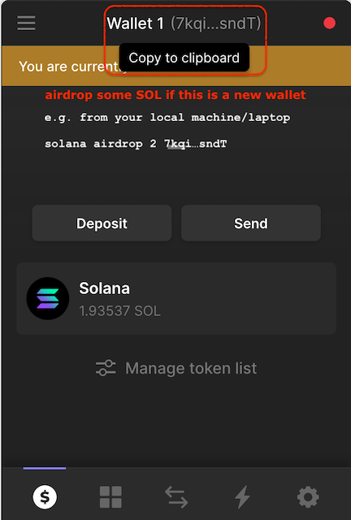
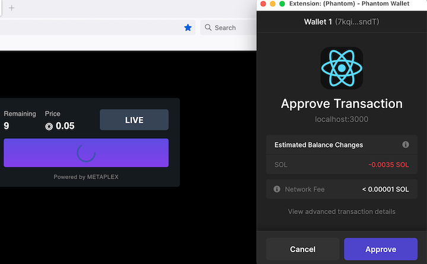

# auto_publish_nft

Metaplex Candy Machine V2 automation script for testing on **devnet**.
To get started, clone this repo's `main` branch. All updates are under `main` branch.

```bash
# under some %SOME_ROOT_PATH% on your local machine
git clone -b main git@github.com:alee-blcksync/auto_publish_nft.git
cd auto_publish_nft
```

To setup environment, etc.
You only need to run this once.

```bash
./setup.sh
```

To create your NFT and upload to Solana **devnet**.
You can run this many times, each time creates a new set of NFT with a new Candy Machine.
We re-use the same jpeg/png files and metadata here as an example only.

```bash
# default CAPTCHA is disabled
./create_my_nft_candymachineV2.sh
# If you want to enable CAPTCHA, use the -c option
./create_my_nft_candymachineV2.sh -c
```

a copy of metaplex output in file `metaplex.log` will also be created in case your console is reset when lauching the mint UI.

## Example

The following runs the script and show some of the console output for explanation. Test wallet address has been masked, although, it is generated randomly everytime.

```bash
% ./create_my_nft_candymachineV2.sh 
solana-cli 1.10.8 (src:623ac656; feat:1122441720)
Refusing to overwrite %SOME_ROOT_PATH%/auto_publish_nft/mynft-keypair.json without --force flag
Refusing to overwrite %SOME_ROOT_PATH%/auto_publish_nft/mynft-treasury.json without --force flag
Refusing to overwrite %SOME_ROOT_PATH%/auto_publish_nft/devnet-keypair.json without --force flag
Config File: $USER/.config/solana/cli/config.yml
RPC URL: https://metaplex.devnet.rpcpool.com/ 
WebSocket URL: wss://metaplex.devnet.rpcpool.com/ (computed)
Keypair Path: %SOME_ROOT_PATH%/auto_publish_nft/devnet-keypair.json 
Commitment: confirmed 
Config File: $USER/.config/solana/cli/config.yml
RPC URL: https://metaplex.devnet.rpcpool.com/ 
WebSocket URL: wss://metaplex.devnet.rpcpool.com/ (computed)
Keypair Path: %SOME_ROOT_PATH%/auto_publish_nft/devnet-keypair.json 
Commitment: confirmed 
Config File: $USER/.config/solana/cli/config.yml
RPC URL: https://metaplex.devnet.rpcpool.com/ 
WebSocket URL: wss://metaplex.devnet.rpcpool.com/ (computed)
Keypair Path: %SOME_ROOT_PATH%/auto_publish_nft/devnet-keypair.json 
Commitment: confirmed 
Airdrop 2 SOL to 3aN************S5oPymj**************
Requesting airdrop of 2 SOL

Signature: 23L*****************************************************************************LUT

2 SOL
%SOME_ROOT_PATH%/auto_publish_nft/uploaded_assets %SOME_ROOT_PATH%/auto_publish_nft
%SOME_ROOT_PATH%/auto_publish_nft
Current solana wallet is configured to 3aN************S5oPymj**************
Current NFT treasury wallet is configured to ADw****************iQbde*************
~%SOME_ROOT_PATH%/auto_publish_nft/metaplex/js ~%SOME_ROOT_PATH%/auto_publish_nft
yarn install v1.22.15
[1/5] 🔍  Validating package.json...
[2/5] 🔍  Resolving packages...
success Already up-to-date.
✨  Done in 1.44s.
wallet public key: 3aN************S5oPymj**************
Using cluster devnet
WARNING: The "arweave" storage option will be going away soon. Please migrate to arweave-bundle or arweave-sol for mainnet.

Beginning the upload for 10 (img+json) pairs
started at: 1657125200000
initializing candy machine
Candy machine address:  8Fs************NfR2Yi***************
Collection metadata address:  9MY************EmT**************
Collection metadata authority:  3aN************S5oPymj**************
Collection master edition address:  AXA************25QZ****************
Collection mint address:  5pg************VN93*************
Collection PDA address:  4fr***************zUZR***************
Collection authority record address:  4fT****************xVxmX****************
Progress: [░░░░░░░░░░░░░░░░░░░░░░░░░░░░░░░░░░░░░░░░] 0% | 0/10Collection:  {
  collectionMetadata: '9MY************EmT**************',
  collectionPDA: '4fr***************zUZR***************',
  txId: 'wXDd****************************************************************************'
}
initialized config for a candy machine with publickey: 8Fs************NfR2Yi***************
[0] out of [10] items have been uploaded
Starting upload for [10] items, format {"mediaExt":".png","index":"0"}
Progress: [████████████████████████████████████████] 100% | 10/10
Writing all indices in 1 transactions...
Progress: [████████████████████████████████████████] 100% | 1/1
Done. Successful = true.
ended at: 2022-07-06T11:35:46.485Z. time taken: 00:00:43
Verifying upload
wallet public key: 3aN************S5oPymj**************
Using cluster devnet
Checking 10 items that have yet to be checked...
Looking at key  0
Looking at key  1
Looking at key  2
Looking at key  3
Looking at key  4
Looking at key  5
Looking at key  6
Looking at key  7
Looking at key  8
Looking at key  9
uploaded (10) out of (10)
ready to deploy!
%SOME_ROOT_PATH%/auto_publish_nft
Candy Machine account is 8Fs************NfR2Yi***************
Starting local UI localhost:3000 for you to mint, you can use Firefox/Chrome Phantom extension and mint
Use 'solana airdrop 2 YOUR_WALLET' to airdrop 2 solana to your Phantom wallet to mint
To start a local mint server and UI, run the following. It will reset your screen, so review logs if necessary before running it.

#########################################
cd metaplex/js/packages/candy-machine-ui
yarn install && yarn start
#########################################
```

To run the UI, open a new console `Ctrl+T` OR within the same console, copy/paste the above command from the last 2-4 lines.
The Mint UI has NOT been configured with `CAPTCHA`. To enable CAPTCHA, use the `-c` option.
When you connect your Phantom wallet, make sure you switch to `devnet` as well and airdrop a few SOL to your new empty wallet to mint.
e.g.

```bash
solana config set --url https://metaplex.devnet.rpcpool.com/
solana airdrop 2 YOUR_WALLET
```

### Examples of MINT UI

switch to metaplex repository, under `js/packages/candy-machine-ui`. e.g.

```bash
cd metaplex/js/packages/candy-machine-ui
yarn install && yarn start
```

- Open `localhost:3000` from your browser.

  

- Configure Phantom Wallet Network

  

- Change Network to `devnet`

  

- Airdrop some SOL on your new wallet since it will be empty on devnet. e.g. make sure you are using `devnet` to airdrop as well.

  ```bash
  solana config set --url https://metaplex.devnet.rpcpool.com/
  solana airdrop 2 YOUR_WALLET
  ```

  

- Click on `MINT` button

  

- If you enabled CAPTCHA with the `-c` option, it will show up to verify if you are a human or not.
  If you want to use `solana` CLI to mint, you will need to disable CAPTCHA.
  Default will NOT ask for CAPTCHA.

  

- Approve transaction

  

- Approve transaction again

  

- That's it. Show your NFT.

  
